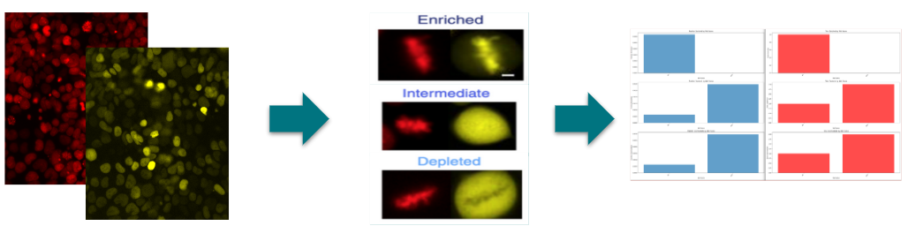
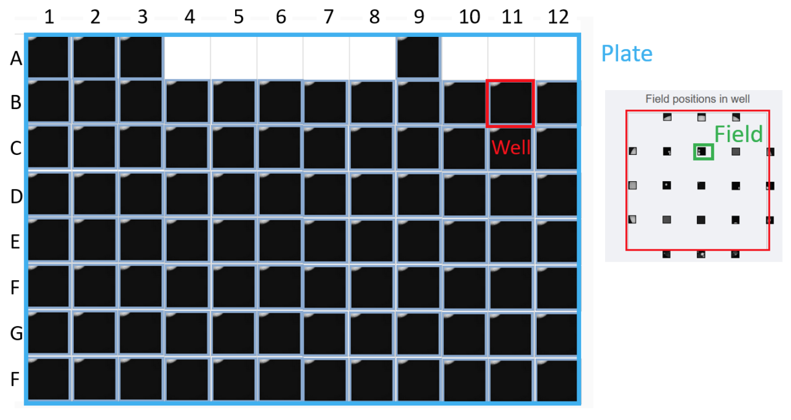
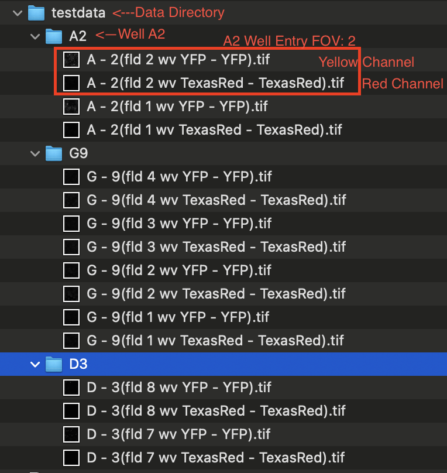
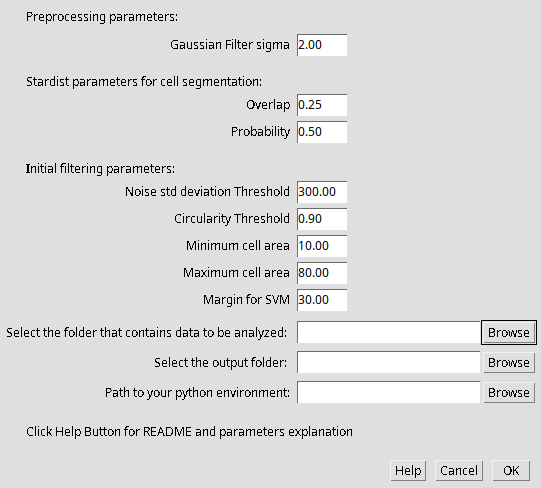
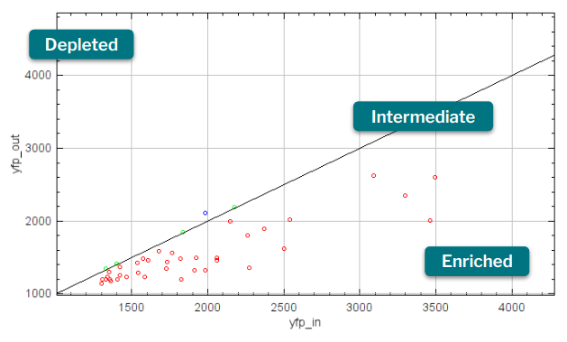
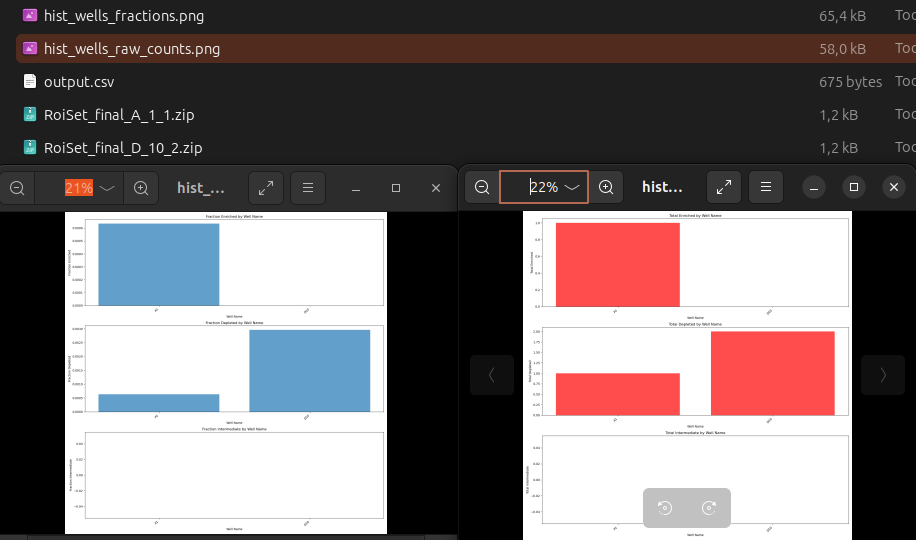

<hr>

 
<hr>
<h3 style="font-weight:500; font-size:2.5em">Transcription Factor Classification Based on Cellular Compartment During Metaphase</h3>

# Description
Transcription factors (TFs) are proteins that regulate gene expression by controlling the rate of transcription, which is the process of converting DNA into mRNA. The plugin aims to classify the spatial location of transcription factors in cells during metaphase. The software requires two images: one representing the transcription factor (for this project, stained using a yellow fluorescent protein (YFP)) and another one staining the DNA (for this project, stained with Texas Red).

After segmenting the position of single cells using the red channel (employing Stardist) and selecting only the cells in metaphase (using random forest classification algorithms), features relative to the yellow channel for each cell are extracted. Utilizing a thresholding method, the cells are classified into three possible classes:

- **Enriched**: If the TF is concentrated in the nucleus with little or no presence in the cytoplasm, meaning that all transcription sites are bound and the gene is highly expressed.
- **Intermediate**: If the TF is distributed in and out of the nucleus, meaning that some transcription sites are bound and the gene is normally expressed.
- **Depleted**: If the TF is concentrated in the cytoplasm (outside of the nucleus), meaning that no or very few transcription sites are bound and the gene is weakly expressed.

The plugin returns the output of its analysis in two different formats: a CSV file with the number of cells in the three different states for each image processed and images depicting histograms with the relative frequencies of the three different classes.



# Installation

## Python Virtual Environment

The first step is to create and initialise a python virtual environment.

Make sure you have conda installed on your computer. If not, please follow this [webpage](https://conda.io/projects/conda/en/latest/user-guide/install/index.html) for installation.

Create a conda environment as follows:

```bash
conda create -n TF_VE python=3.9
conda activate TF_VE
conda install joblib pandas scikit-learn==1.2.2 matplotlib
```

Move to the folder containing the environment:

```bash
conda env list
cd <path_TF_VE>
```
Create a folder named `classify_metaphase` and move there:

```bash
mkdir classify_metaphase
cd classify_metaphase
```
From the GitLab project download the files [classify_metaphase_random_forest.py](https://gitlab.epfl.ch/dcorrea/project-tst/-/blob/main/src/training_data_metaphase/classify_metaphase_random_forest.py?ref_type=heads),  [rf_model.joblib](https://gitlab.epfl.ch/dcorrea/project-tst/-/blob/main/src/training_data_metaphase/rf_model.joblib?ref_type=heads) and [plots.py](https://gitlab.epfl.ch/dcorrea/project-tst/-/blob/main/src/training_data_metaphase/plots.py?ref_type=heads). Then move them in the `classify_metaphase` folder created before.

##  Plugin Download

Once the python virtual environment have been created, download the [.jar file plugin](https://gitlab.epfl.ch/dcorrea/project-tst/-/blob/main/target/project-tst-1.0.0-SNAPSHOT.jar?ref_type=heads) and copy it into the `plugin` folder of Fiji.

**Note**: If you need help finding the `plugin` folder on a MacOS, please refer to [this link](https://imagej.net/platforms/macos#accessing-fijis-plugins-and-macros-folders)

## Dependencies Download

The plugin to work needs the following dependencies:

* stardist-imagej from com.github.stardist (version: 0.3.0) --> Fiji name **StarDist**
* csbdeep from de.csbdresden (version: 0.6.0) --> Fiji name **CSBDeep**

In oder to activate StarDist and CSBDeep follow the [installation guidelines](https://imagej.net/plugins/stardist):
* Select `Help > Update...` from the menu bar. 
* Click on the button `Manage update sites`.
* Scroll down the list and tick the checkboxes for update sites `CSBDeep` and `StarDist`, then click the `Close` button.
   * If StarDist is missing, click Update URLs to refresh the list of update sites.
* Click on `Apply changes` to install the plugin.
* Restart Fiji.

# Data Formatting

The images required by the plugin follow a meticulously designed field of view multiplexing paradigm. Within this framework, each well represents a distinct experimental condition, such as varying drug concentrations. Subsequently, each well undergoes multiple imaging sessions across different field of views (FoV). Each FoV captures a single image, divided into two channels: red for DNA and yellow for TF (Transcription Factor).




Following this framework, the plugin expects the images to be organized in the following hierarchical structure: images of the same FoV should reside within the same folder, and FoVs from the same well should be grouped together in their respective folders.

Below, you'll find the naming conventions for each well, along with the files for the red and yellow channels:
## Well Folder Naming Convention
Each well is represented by a folder named using the following format:
* `<Well Letter><Well Number>`
  * Example: `D3`

## Field of View Images
A well can have multiple fields of view. Each field of view consists of two images: a red channel image and a yellow channel image. The naming convention for these images is as follows:

### Red Channel Image
The red channel image for a well with letter "X", well number "Y", and field of view "Z" is named using the following format:
* `<Well Letter> - <Well Number>(fld <Field of View> wv TexasRed - TexasRed).tif`
  * Example: `D - 3(fld 8 wv TexasRed - TexasRed).tif`

### Yellow Channel Image
The yellow channel image for a well with letter "X", well number "Y", and field of view "Z" is named using the following format:
* `<Well Letter> - <Well Number>(fld <Field of View> wv YFP - YFP).tif`
  * Example: `D - 3(fld 8 wv YFP - YFP).tif`

This structured naming convention helps in systematically organizing and identifying the well and its corresponding images for different fields of view.

Here is an example of how your data folder should look like:




# Step-by-Step user Guide

For a step-by-step video tutorial of the plugin, please see [tutorial](https://gitlab.epfl.ch/dcorrea/project-tst/-/blob/main/demo_tf.webm?ref_type=heads).

## Input Variables GUI
After properly formatting the input images, the plugin can be run. Firstly, open the plugin GUI page by going into `Plugins -> TF Analyze`.



Select the proper parameters for the running code:

- **Gaussian Filter Sigma**: The sigma of the Gaussian filter used for blurring the image in the preprocessing phase.
- **Overlap**: Degree of overlapping accepted in cell segmentation with [Stardist](https://imagej.net/plugins/stardist).
- **Probability**: Threshold probability within which an ROI is considered a proper cell in [Stardist](https://imagej.net/plugins/stardist).
- **Noise Std Threshold**: Threshold below which the image is considered too noisy and not processed.
- **Circularity Threshold**: Threshold above which the ROI (i.e., putative single cell) is considered too round and thus not considered in metaphase.
- **Minimum Cell Area**: Threshold below which the ROI (i.e., putative single cell) is considered too small and thus not considered in metaphase.
- **Maximum Cell Area**: Threshold above which the ROI (i.e., putative single cell) is considered too big and thus not considered in metaphase.
- **Margin for SVM**: Value on which the software decides which class the single cell is classified into. Lower values create more restrictive rules for intermediate classification.



Lastly, insert the folder of the input data, the folder where to save the new data, and the folder containing the Python virtual environment created in the installation procedure.

**ATTENTION**: If the processed dataset overcomes the limit memory set on your PC, the plugin might crash. We suggest you to process your data in batches or to expand the memory limits of Fiji `Help->Change memory settings`.

## Output explanation
The program generates four output files:

- `output.csv`: This file contains features and class numerosity for each image.

    * The total count of depleted, intermediate, and enriched cells.
    * The fraction they represent over the total number of segmented nuclei. 
    * A comment indicating if the image was empty, too noisy, or normal.
- `hist_wells_fractions.png`: This file comprises three distinct histograms, each representing a class. Each bin corresponds to an image (i.e., combination of Well and Fov), with its height indicating the number of cells classified as that class divided by the total number of cells detected in the image by StarDist. Only correct images are depicted in the final histograms.

- `hist_raw_counts.png`: Similar to the previous histogram, this file also contains three distinct histograms, one for each class. Each bin represents an image (i.e., combination of Well and Fov), with its height indicating the raw number of cells classified as that class. Once again, only correct images are included in the final histograms.

- ROIs in a ZIP file: For each image, a ZIP file containing the Regions of Interest (ROIs) is provided. These ROIs enable the verification of segmentation results.




# Credits & Contact Information
Daniela Correa Orozco, Computer Science, daniela.correa@epfl.ch
Gabriele Dall’Aglio, Neuro-X, gabriele.dallaglio@epfl.ch
Iouri Loup Hugues Vincent Prost, Microengineering, iouri.prost@epfl.ch


